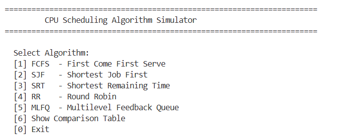
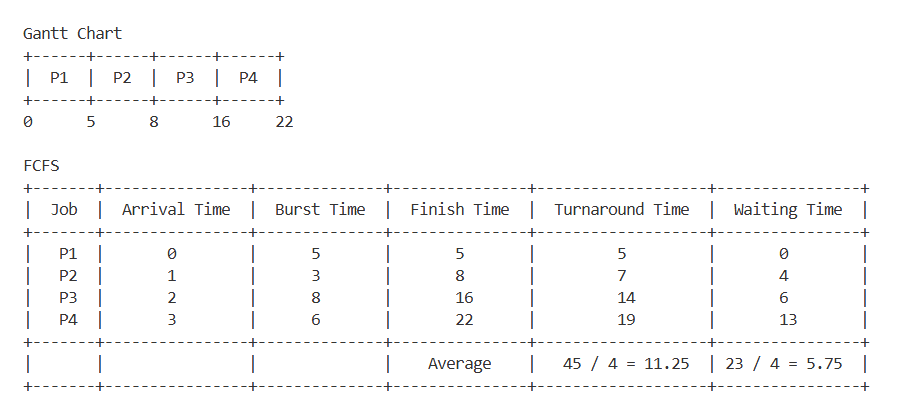
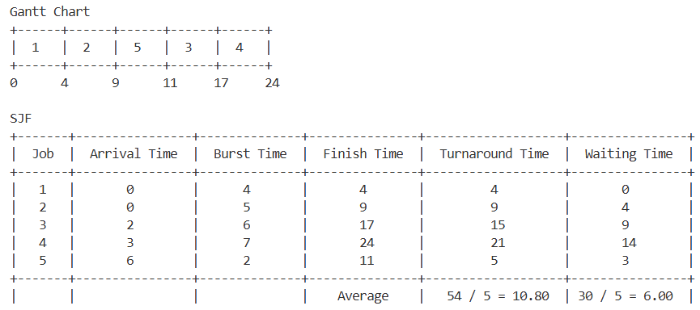

# OS-CPU-Scheduling-Team6
## Team Members
| Name            | Student ID | Algorithms |
| Bun Hunheng     | IDTB110331 | FCFS, SJF |
| Sary Farit      | IDTB110195 | SRT, Round Robin |
|Oun Vireak       | IDTB110208 | MLFQ |

- **Git Repository:** [paste your repo URL here]
- **Video Presentation:** [paste your YouTube URL here]

---

## Project Overview
A CLI CPU Scheduling Simulator that implements
5 scheduling algorithms and calculates Waiting Time,
Turnaround Time, and Response Time for each process.

---

## Algorithms Implemented

### FCFS (First Come First Serve)
Executes processes in arrival order. Non-preemptive.
Simple but short processes may wait too long if it stay after long burst time.

### SJF (Shortest Job First - Non-preemptive)
Picks the process with shortest burst time next.
Minimizes average waiting time but may starve long jobs.

### SRT (Shortest Remaining Time - Preemptive)
Preemptive version of SJF. Switches to a shorter
process the moment one arrives. Optimal waiting time.

### Round Robin (RR)
Each process gets a fixed time quantum .
Ensures fairness and best response time for all.

### MLFQ (Multilevel Feedback Queue)
3 queues: Q1 RR q=2, Q2 RR q=4, Q3 FCFS.
Processes demote on timeout, promote via aging.
Balances responsiveness and fairness dynamically.

---

## Setup & Installation

**Requirements:**
- Python 3.x
- VS Code 

**Steps:**

1. Clone the repository
```
git clone https://github.com/hunheng-777/OS-CPU-Scheduling-Team6.git
```

2. Go into the project folder
```
cd OS-CPU-Scheduling-TeamB
```

3. Check Python is installed
```
python --version
```

4. Run the simulator
```
python main.py
```

---

## How to Run Each Scheduler

1. Open VS Code
2. Open the terminal inside VS Code
3. Make sure you are inside the project folder
4. Run the program
```
python main.py
```
5. Follow the on-screen prompts:
   - Enter number of processes
   - Enter Arrival Time and Burst Time for each process
   - Select the scheduling algorithm (1–5)
   - For Round Robin, enter the Time Quantum when asked
6. The Gantt chart and metrics table will display
   in the terminal output

## Sample Input

| Process | Arrival Time | Burst Time |
|---------|-------------|------------|
| P1      | 0           | 8          |
| P2      | 1           | 4          |
| P3      | 2           | 9          |
| P4      | 3           | 5          |

## Sample Output (FCFS)

Gantt Chart:
| P1 | P2 | P4 | P3 |
0    8   12  17  26

Average Waiting Time    : 7.75
Average Turnaround Time : 14.25
Average Response Time   : 7.75

---

## Screenshots





---

## References
- González-Rodríguez, M., Otero-Cerdeira, L., González-Rufino, E., & Rodríguez-Martínez, F. J. (2024). Study and evaluation of CPU scheduling algorithms. Heliyon, 10(9).
- Silberschatz, A., Galvin, P. B., & Gagne, G. (2018). Operating System Concepts (10th ed.). Wiley.
